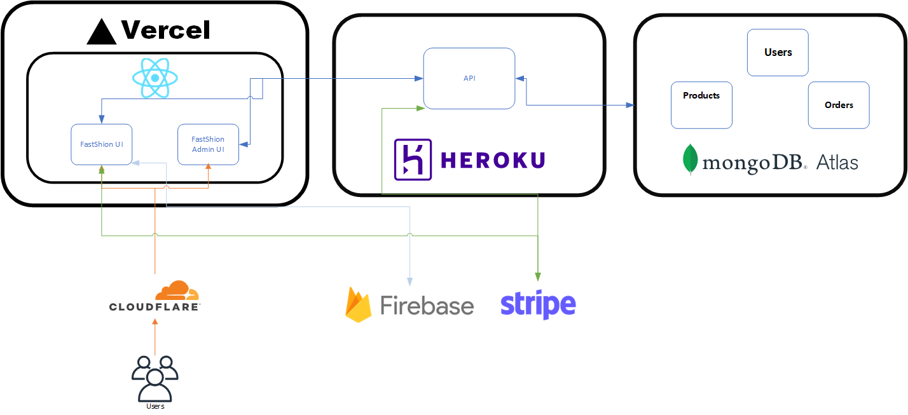

<div id="top"></div>

[![Contributors][contributors-shield]][contributors-url]
[![Forks][forks-shield]][forks-url]
[![Stargazers][stars-shield]][stars-url]
[![Issues][issues-shield]][issues-url]
[![MIT License][license-shield]][license-url]
[![LinkedIn][linkedin-shield]][linkedin-url]

<!-- PROJECT LOGO -->
<br />
<div align="center">
  <a href="https://github.com/pphan93/FastShion">
    
  </a>

<h3 align="center">FastShion</h3>

  <p align="center">
    DON'T MISS OUT. Our collections will rotate every seasons, some of the collections might not be available ever again. Buy them while they last.
    <br />
    <a href="https://github.com/pphan93/FastShion"><strong>Explore the docs »</strong></a>
    <br />
    <br />
    <a href="#demo">View Demo</a>
    ·
    <a href="https://github.com/pphan93/FastShion/issues">Report Bug</a>
    ·
    <a href="https://github.com/pphan93/FastShion/issues">Request Feature</a>
  </p>
</div>

<!-- TABLE OF CONTENTS -->
<details>
  <summary>Table of Contents</summary>
  <ol>
    <li>
      <a href="#about-the-project">About The Project</a>
      <ul>
        <li><a href="#design-phase">Design Phase</a></li>
        <li><a href="#architecture-diagram">Architecture Diagram</a></li>
        <li><a href="#tech-stack">Tech Stack</a></li>
      </ul>
    </li>
    <li>
      <a href="#getting-started">Getting Started</a>
      <ul>
        <li><a href="#demo">Demo</a></li>
        <li><a href="#prerequisites">Prerequisites</a></li>
        <li><a href="#installation">Installation</a></li>
      </ul>
    </li>
    <li><a href="#usage">Usage</a></li>
    <li><a href="#roadmap">Roadmap</a></li>
    <li><a href="#contributing">Contributing</a></li>
    <li><a href="#license">License</a></li>
    <li><a href="#contact">Contact</a></li>
    <li><a href="#acknowledgments">Acknowledgments</a></li>
  </ol>
</details>

<!-- ABOUT THE PROJECT -->

## About The Project

[![Product Name Screen Shot][product-screenshot]](https://fastshion.pphan.ca/)


https://user-images.githubusercontent.com/5741352/169182468-cbb92421-b298-4498-9ce5-0815b74da0cf.mp4


FastShion is online store that sells fast fashion clothes. Our collections will rotate every seasons, some of the collections might not be available ever again.

<p align="right">(<a href="#top">back to top</a>)</p>

### Design Phase

The site was built using styled components for the store and ReactJS CSS Module for the admin dashboard. There is no css frameworks.

The project is broken down to 3 components.

#### FastShion UI

This is the github repo for the UI. It is using styled components package for css module.

#### FastShion Admin Dashboard UI

[FastShion Admin Dashboard](https://github.com/pphan93/FastShion-AdminDash)

It is using ReactJS CSS module instead of styled component package.

### Architecture Diagram



#### Vercel

I want a place to host my FastShion and Admin Dashboard UI. There are many options that greatly in the amount of control vs work done for me. Since this is to host the application to showcase my skillsets I want to pick a service that do most of my heavy lifting. I chose Vercel because it does most of the heavy lifting, straight forward to use and most of the features I want are free.

#### mongoDB Atlas

The database is being host on mongoDB Atlas, which is free with some limitation. Throughout this project, I chose a hosting providers that are free to use and have some great benefit such as SSL and custom domain.

#### Heroku

Vercel is mostly for hosting front end (ReactJS, Vue, etc), and NextJS. However, it is lacking option to host backend server that are running NodeJs and Express like FastShion API. They do support serverless function that could run the NodeJS and Express but that will require modifying the code to run on Vercel. Due to time constraint, I look at other services such as AWS Beanstalk, Azure App Service, and Heroku. The issues with AWS and Azure is the free version either doesn't support SSL or resource is limited. I ended up picking Heroku for those reasons above. It provide simple deployment solution, and the free tier provided SSL and more resources.

### Tech Stack

- [ReactJs](https://reactjs.org/) was used to build the UI for the store and admin dashboard. ReactJs is one of the most popular front-end frameworks.
- [Vercel](https://vercel.com/) was used as a hosting platform for the ReactJS application. This is simple to use and it is free with many features.
- [MongoDB](https://www.mongodb.com/) was used as a NoSQL database. It is currently being hosted on mongoDB Atlas.
- [Heroku](https://aws.amazon.com/lambda/) for hosting the backend server running NodeJS and Express. This is for the RESTful API.
- [Stripe](https://stripe.com/en-ca) was used to process payments.
- [Firebase](https://firebase.google.com/) was used to store products image.
- [Styled Components](https://styled-components.com/) was used for the fastshion UI site.
- [CloudFlare](https://www.cloudflare.com/) uses as proxy between the users and server. This come with many benefits (free tier) such as CDN, DNS, DDOS, Ruleset.

<p align="right">(<a href="#top">back to top</a>)</p>

<!-- GETTING STARTED -->

## Getting Started

To get a local copy up and running follow these simple example steps.

### Demo

**See below for a quick demo. You can also try it out using this login.**

<a href="https://fastshion.pphan.ca/">View Store Demo</a>

<a href="https://fastshion-dash.pphan.ca/">View Admin Dashboard Demo</a>

```
Username: admin
Password: 12344
```

### Prerequisites

- [NodeJS](https://nodejs.dev/learn/how-to-install-nodejs) - Lastest version, please follow instruction from official document

- [npm](https://docs.npmjs.com/downloading-and-installing-node-js-and-npm)
  ```sh
  npm install npm@latest -g
  ```

### Installation

1. Install mongodb and configure it. You can use mongodb atlas if you dont want to install [MongoDB Atlas](https://docs.atlas.mongodb.com/getting-started/). Please go ahead and register it and then get connection detail for nodejs.
2. Clone the repo
   ```sh
   git clone https://github.com/pphan93/FastShion.git
   ```
3. Install NPM packages
   ```sh
   npm install
   ```
4. Enter your API in `env.local` - create the file if you haven't already in the root folder of the project

   ```js
   REACT_APP_STRIPE = xxxx;
   REACT_APP_API_URL = xxxx;
   ```

<p align="right">(<a href="#top">back to top</a>)</p>

<!-- USAGE EXAMPLES -->

## Usage

Use this space to show useful examples of how a project can be used. Additional screenshots, code examples and demos work well in this space. You may also link to more resources.

_For more examples, please refer to the [Documentation](https://example.com)_

<p align="right">(<a href="#top">back to top</a>)</p>

<!-- ROADMAP -->

## Roadmap

- [ ]
- [ ]
- [ ]

See the [open issues](https://github.com/pphan93/FastShion/issues) for a full list of proposed features (and known issues).

<p align="right">(<a href="#top">back to top</a>)</p>

<!-- CONTRIBUTING -->

## Contributing

Contributions are what make the open source community such an amazing place to learn, inspire, and create. Any contributions you make are **greatly appreciated**.

If you have a suggestion that would make this better, please fork the repo and create a pull request. You can also simply open an issue with the tag "enhancement".
Don't forget to give the project a star! Thanks again!

1. Fork the Project
2. Create your Feature Branch (`git checkout -b feature/AmazingFeature`)
3. Commit your Changes (`git commit -m 'Add some AmazingFeature'`)
4. Push to the Branch (`git push origin feature/AmazingFeature`)
5. Open a Pull Request

<p align="right">(<a href="#top">back to top</a>)</p>

<!-- LICENSE -->

## License

Distributed under the MIT License. See `LICENSE.txt` for more information.

<p align="right">(<a href="#top">back to top</a>)</p>

<!-- CONTACT -->

## Contact

Phuoc Phan

Project Link: [https://github.com/pphan93/FastShion/issues](https://github.com/pphan93/FastShion/issues)

<p align="right">(<a href="#top">back to top</a>)</p>

<!-- ACKNOWLEDGMENTS -->

<!-- ## Acknowledgments

- []()
- []()
- []() -->

<!-- <p align="right">(<a href="#top">back to top</a>)</p> -->

<!-- MARKDOWN LINKS & IMAGES -->
<!-- https://www.markdownguide.org/basic-syntax/#reference-style-links -->

[contributors-shield]: https://img.shields.io/github/contributors/pphan93/FastShion.svg?style=for-the-badge
[contributors-url]: https://github.com/pphan93/FastShion/contributors
[forks-shield]: https://img.shields.io/github/forks/pphan93/FastShion.svg?style=for-the-badge
[forks-url]: https://github.com/pphan93/FastShion/network/members
[stars-shield]: https://img.shields.io/github/stars/pphan93/FastShion.svg?style=for-the-badge
[stars-url]: https://github.com/pphan93/FastShion/stargazers
[issues-shield]: https://img.shields.io/github/issues/pphan93/FastShion.svg?style=for-the-badge
[issues-url]: https://github.com/pphan93/FastShion/issues
[license-shield]: https://img.shields.io/github/license/pphan93/FastShion.svg?style=for-the-badge
[license-url]: https://github.com/pphan93/FastShion/blob/master/LICENSE.txt
[linkedin-shield]: https://img.shields.io/badge/-LinkedIn-black.svg?style=for-the-badge&logo=linkedin&colorB=555
[linkedin-url]: https://www.linkedin.com/in/phuoc-phan/

[product-screenshot]:
[product-diagram]: readme/FastShion_Diagram.png
